# 产品介绍
## TuGraph是什么？
TuGraph是蚂蚁集团自主研发的企业级图数据管理平台，提供了从图存储、研发、服务、运维的图研发全链路，方便用户更好的管理、使用图数据。拥有业界领先规模的图集群，解决了图数据分析面临的大数据量、高吞吐率和低延迟等重大挑战，是蚂蚁集团金融风控能力的重要基础设施，显著提升了欺诈洗钱等金融风险的实时识别能力和审理分析效率，并面向金融、工业、政务服务等行业客户。
企业级图数据管理平台TuGraph包含TuGraph DB（在线图数据库引擎）、TuGraph Analytics（图计算引擎）、TuGraph Platform（一站式图平台）及TuGraphLink（数据集成工具）四部分。
**TuGraph DB（在线图数据库引擎）：**分布式企业级图数据库，提供图数据的实时存储和查询能力，主要面向对局部数据的海量并发查询。满足在超大数据量上实现高吞吐率和低延迟，保障业务对事务和数据一致性的要求。对应于数据库领域的联机事务处理 OLTP (Online Transactional Processing) 。
**TuGraph Analytics（图计算引擎）：**低开销高性能的内存图分析系统，提供超大规模图的图数据迭代计算能力，主要面向少量并发下，对全图数据的迭代计算。满足吞吐率较低，但计算量大的业务场景，通常处理时间在秒级到分钟级。对应于数据库领域的联机分析处理 OLAP (Online Analytical Processing)。
**TuGraph Platform（一站式图平台）：**可视化一站式图研发运维管理平台，提供从图模型构建到研发、分析、上线、运维的图数据全生命周期管理。
**TuGraphLink（数据集成工具）：**稳定、高效的图数据集成平台，提供一站式图数据迁移企业级服务，提供各类数据源与图数据库之间的数据迁移、数据实时同步等多种数据传输能力，可协助业务在跨境数据同步、数据灾备、无缝迁移等企业级场景构建安全、高可用、高吞吐的数据链路。

## 面向用户群体
TuGraph已应用于蚂蚁内部300多个场景，**包括全图风控、反洗钱、反欺诈、保险知识图谱、花呗图谱、蚂蚁森林、新春五福等业务场景**。并向全部业务方提供图的全方位产品服务，服务群体涵盖技术研发人员、算法分析人员、业务分析人员、运维管理人员等。
如果你是**技术研发人员**，TuGraph将为您提供：

   - **丰富的客户端支持：**提供丰富的编程语言及API接口，包括但不限于Java SDK、Python SDK、C++ SDK、Console客户端（otter）等；
   - **标准的图查询语言：**提供国际标准化图查询语言ISO-GQL，降低学习成本；
   - **完整的图研发流程：**提供图构建、图查询、图分析、图服务等图数据研发全生命周期管理；

如果你是**算法分析人员**，TuGraph将为您提供：

   - **高性能图计算引擎：**低开销高性能的分布式内存图分析系统，提供强大的图数据计算能力，主要面向少量并发下，对全图数据的迭代计算；
   - **丰富的图算法集成：**内置6大类30多种图分析算法，便于挖掘业务价值；
   - **可视化灵活调度：**提供灵活调度、可视化配置图算法模式，提升使用灵活性；

如果您是**业务分析人员**，TuGraph将为您提供:

   - **大规模可视化图展示：**基于万亿级图计算的产出结果进行更大规模、更大深度的图探索和图展示；
   - **丰富多样的图分析能力：**TuGraph图分析提供一系列契合业务的通用图分析操作，如全局的配置查询、语句查询、模板查询、画布工具栏、外观配置、分组、聚合、共同邻居、重要节点、模式匹配、自定义可疑标签、涉黑判断（加入黑名单&白名单）、保存分析、我的分析模块，样式模板、超链跳转配置、配置管理、发布嵌入、大点巡检&删除等；
   - **易被业务集成嵌入：**可以快速被业务应用集成，可直接将功能模块发布嵌入至第三方业务系统中；

如果您是**运维管理人员**，TuGraph将为您提供：

   - **可视化集群监控管理：**实时监控集群运行健康状态；
   - **可视化集群运维管控：**轻松在线完成扩缩容、在线升级、副本操作、流量变更等集群运维操作；
   - **灵活完善的备份恢复：**提供集群、图级别、label级别等不同级别全量、增量备份恢复能力；
   - **可视化日志管理能力：**便于方便、快速分析诊断问题；


## 使用流程
TuGraph使用流程如下图所示：
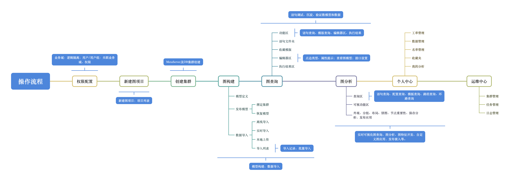
按照如下步骤使用TuGraph：

   - **权限配置**
   - **新建图项目**
   - **创建集群**
   - **图构建**
   - **图查询**
   - **图分析**
   - **图服务**
   - **个人中心**
   - **运维中心**

# 前置条件
## 本地绑定/etc/hosts
在登录打开TuGraph Platform之前需要本地绑定/etc/hosts，具体执行操作如下：
```
ip geamaker.alipay.net #ip ip为TuGraph Platform所在主机 IP
```
浏览器上输入 https://geamaker.alipay.net 显示登录界面如下，输入用户名和密码后进行登录。
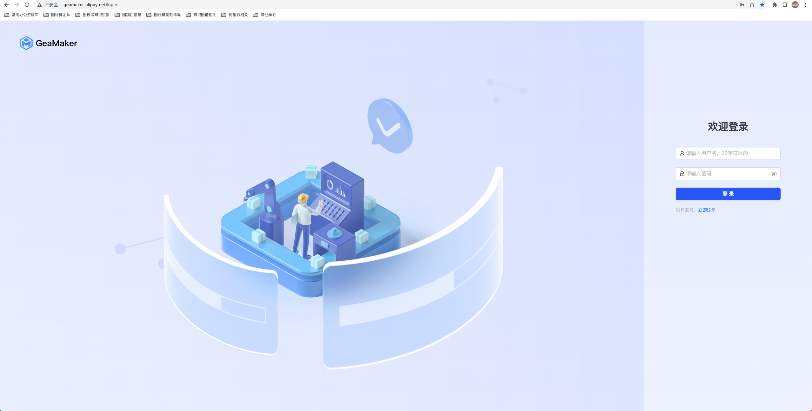

## 权限配置
TuGraph Platform提供默认管理员账户admin/123456，用户亦可自行注册用户。TuGraph Platform提供基于用户-用户组（角色）的权限管理体系，用户通过加入某个用户组来获取该用户组拥有的图项目/数据文件/我的分析/名单/集群等资产的数据权限以及该用户组拥有的功能权限，用户退出用户组后，对应的权限也会被回收。
TuGraph Platform提供自主创建业务域的功能，业务域类似于业务BU的概念，通过业务域实现不同资产的逻辑隔离，用户在选择某个业务域时，会默认进入该业务域的公共用户组下，公共用户组只拥有最低的功能权限，只能看到对该业务域公开的图项目。
### 用户管理
#### 用户注册
在TuGraph Platform登录页，点击“立即注册”即可进行用户注册，如下图所示：
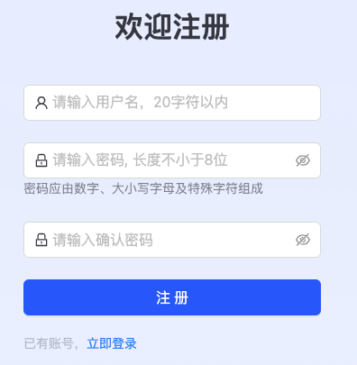
输入用户名、密码，点击注册，完成用户。

#### 用户管理
管理员用户可以查看所有用户、注册时间，如下图所示：
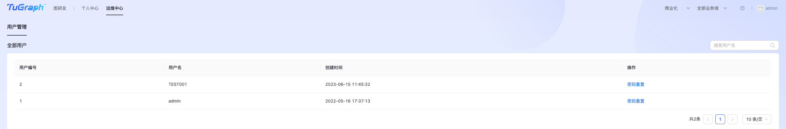
管理员可点击“密码重置”，进行相关用户密码重置操作，如下图所示：
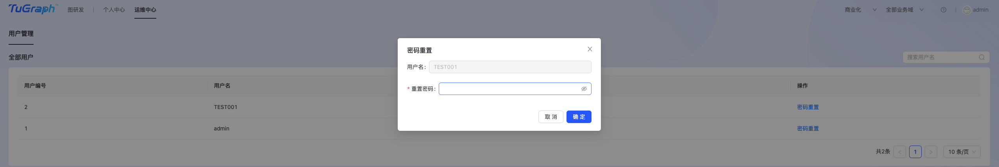

### 用户组
用户组（类似于角色）主要用于管理用户对TuGraph Platform中各项资源的权限，是TuGraph Platform权限的唯一载体。
用户通过加入某个用户组来获取该用户组拥有的图项目/文件/我的分析/名单/集群等资产的数据权限以及该用户组拥有的功能权限，用户退出用户组后，对应的权限也会被回收。
用户组通过申请TuGraph Platform上的功能权限和功能权限来控制本组的权限范围。
注：用户在选择某个业务域时，会默认进入该业务域的公共用户组下，公共用户组只拥有最低的功能权限，只能看到对该业务域公开的图项目
#### 创建用户组
点击“个人中心->用户组和权限”，进入用户组管理界面，如下图所示：
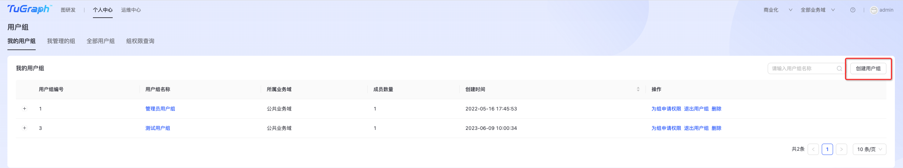
点击“创建用户组”，进入用户组创建页面，如下图所示：
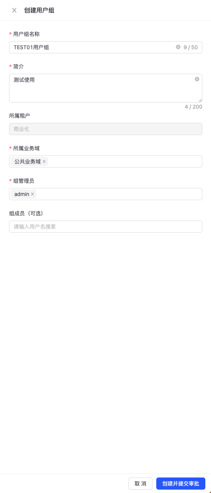
输入“用户组名称”、“简介”，选择“所属业务域”、“组管理员”等信息，点击“创建并提交审批”，管理员审批通过后完成用户组创建。
可在【个人中心->工单管理】中查看工单详情，找到相应的审批人，联系审批人进行审批。


#### 申请加入用户组
点击“个人中心->用户组和权限->全部用户组”，进入全部用户组列表页，如下图所示：
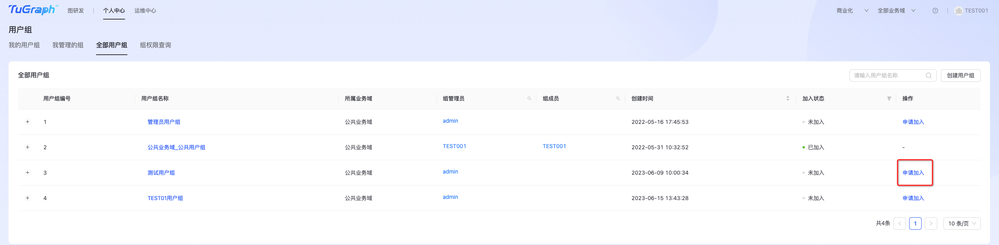
点击“申请加入”，进入申请加入页面，如下图：
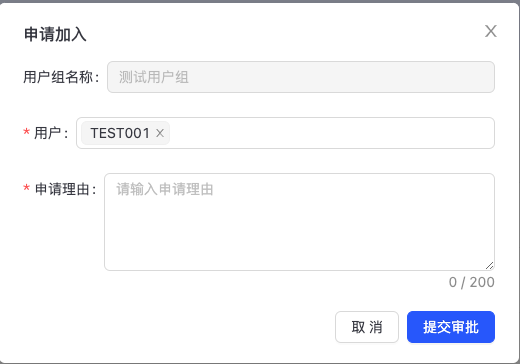
填写“申请理由”，点击“提交审批”，待管理员完成审批后，加入该用户组。审批显示如下：
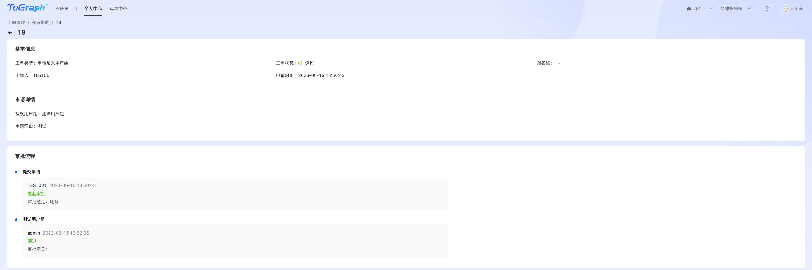
**注：管理员工单自动审批通过；普通用户橘色工单需要管理员手动审批通过。**

#### 我管理的用户组
点击“个人中心->用户组和权限->我管理的组”，进入“我管理的组”列表页，如下图所示：
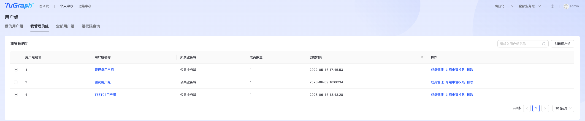
在“我管理的组”页面，可以完成“成员管理”、“为组申请权限”、“删除组”等相关操作。

   - **成员管理**

点击“成员管理”，进入组成员管理页面，如下图所示：
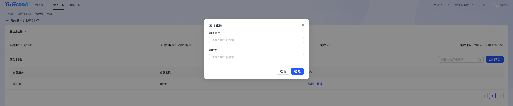
可以在此完成组成员的添加、移除、编辑等操作，编辑是指修改组成员角色，比如将“成员”修改为“管理员”。
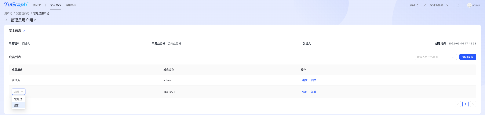

   - **为组申请权限**

点击“为组申请权限”将跳转至“组权限查询”页面，如下图：
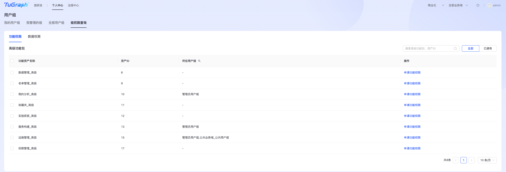
组权限详细操作详见“2.2.2.5. 组权限”。

#### 我的用户组
点击“个人中心->用户组和权限->我的用户组”，进入“我的用户组”列表页，如下图所示：
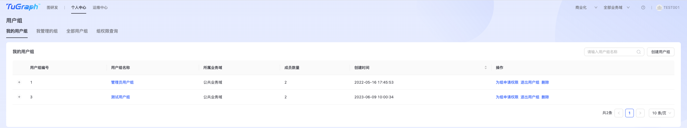

   - **退出用户组**

点击“退出用户组”，弹出“确定退出本用户组”确认页，如下图所示：
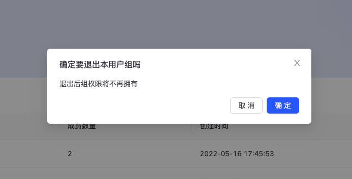
点击“确定”，退出用户组。
注：当退出组时，系统会判断当前组下是否是最后一个人，如果是，需要指定管理员再“退出”，不指定管理员退出的话则直接删除这个组，如果不是则直接退出。

   - **为组申请权限**

点击“为组申请权限”将跳转至“组权限查询”页面，如下图：

组权限详细操作详见“2.2.2.5. 组权限”。

   - **删除**

点击“删除”，弹出“删除用户组”确认页，如下图所示，点击“确定”，完成用户组删除操作。
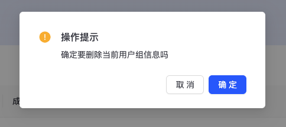

#### 组权限
TuGraph Platform对权限进行了细分，包括功能权限和数据权限两大类。其中功能权限对应TuGraph Platform上的一个功能模块，数据权限是指数据资产，目前平台的数据资产包括图项目、数据文件、我的分析、名单、图集群等。
##### 功能权限
功能权限对应TuGraph Platform上的一个功能模块，目前每个功能模块都有两个对应的功能包，分别是"基础功能包"和"高级功能包"，用户组默认拥有所有的基础功能包，基于已拥有的功能包，用户可以在对应的功能模块进行对应的操作。
每个子功能包权限说明如下：

- 【数据管理】：查看权限，数据修改、编辑、删除等高级权限
- 【名单管理】：查看权限，名单修改、编辑、删除等高级权限
- 【我的分析】：查看权限，分析资产保存、修改、编辑、删除等高级权限
- 【收藏夹】：收藏，取消收藏
- 【实验探索】：查看权限，图项目创建、修改、删除、导入数据等高级权限
- 【服务构建】：查看权限，图项目创建、修改、删除、导入数据等高级权限
- 【运维管理】：查看权限，修改、删除集群信息、任务信息、监控信息，应急操作等高级权限。
- 【权限管理】：

点击“个人中心->用户组和权限->组权限查询->功能权限”，进入“功能权限”列表页，如下图所示：
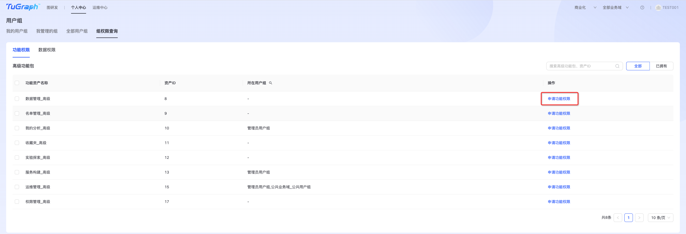
点击“申请功能权限”，进入功能权限申请页，为用户自己相关联的用户组申请权限。
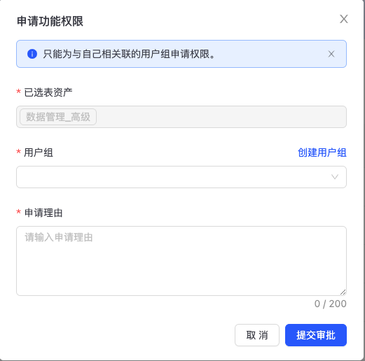
选择“用户组”，填写“申请理由”，点击“提交审批”，待管理员审批通过后，获得相关功能权限。

##### 数据权限
数据权限是指数据资产，目前平台的数据资产包括图项目、数据文件、我的分析、名单、图集群等。数据权限有业务域的限制，加入对应业务域的用户组，才能看到对应业务域的数据资产。
点击“个人中心->用户组和权限->组权限查询->数据权限”，进入“数据权限”列表页，如下图所示：
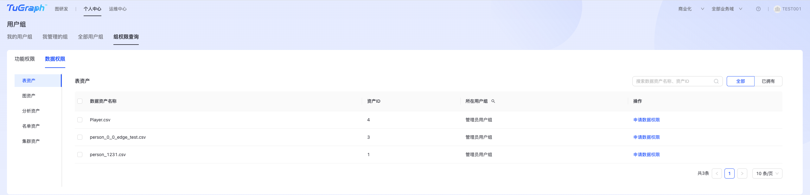
点击“申请数据权限”，进入数据权限申请页，为用户自己相关联的用户组申请权限。
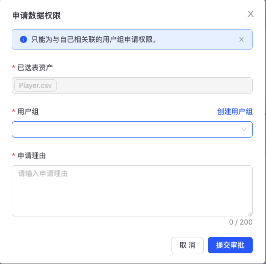
选择“用户组”，填写“申请理由”，点击“提交审批”，待管理员审批通过后，获得相关数据权限。

### 业务域管理
TuGraph Platform提供自主创建业务域的功能，业务域类似于业务BU的概念，通过业务域实现不同资产的逻辑隔离，用户在选择某个业务域时，会默认进入该业务域的公共用户组下，公共用户组只拥有最低的功能权限，只能看到对该业务域公开的图项目。
#### 创建业务域
点击“个人中心->业务域管理”，进入业务域管理页面，如下图所示：
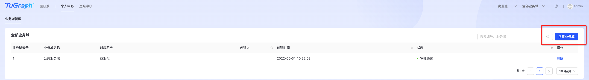
可以通过点击右上角“创建业务域”来创建自己BU的业务域。填入业务域名称和申请理由后，点击【创建并提交审批】按钮后即可成功提交工单。（若该页面没有【创建业务域】按钮，请先在【权限管理】中申请【权限管理-高级功能包】）
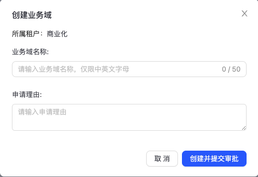
工单审批通过后，业务域自动创建。可在【个人中心->工单管理】中查看工单详情，找到相应的审批人，联系审批人进行审批。


#### 切换业务域
在TuGraph Platform导航栏中可以切换业务域，多业务域用户可以自由切换业务域。图研发卡片列表、名单列表、我的分析列表在不同业务域之间是逻辑隔离的，切换不同业务域，只会显示该业务域下拥有权限的资产。
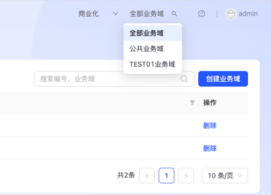

#### 删除业务域
点击“个人中心->业务域管理”，进入业务域管理页面，点击“删除”按钮，弹出业务域删除确认框，如下图所示：
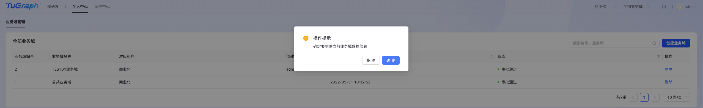
点击“确定”，删除业务域。

#### 用户组与业务域
用户组是资产和权限的拥有者，所有的资产和权限的申请均会挂到用户组下。而业务域的主要作用就是隔离数据权限，两者的关联在于用户组归属于业务域，并且一个用户组可以归属于多个业务域，一个业务域也可以拥有多个用户组。
# 图项目
登录TuGraph Platform，打开产品欢迎页，如下图所示：


## 新建图项目
点击“新建图项目”，如下图所示：
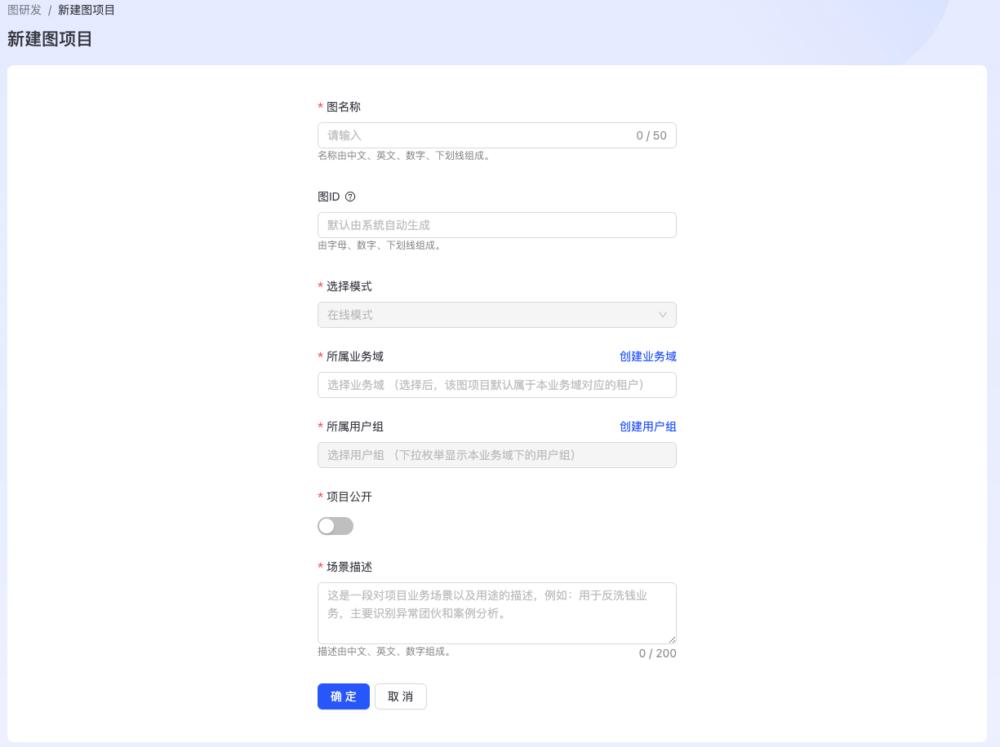
填写图名称，选择所属业务域、用户组等相关信息，点击“确定”完成图项目构建。在“我的项目”列表中显示出新建图项目，如下图所示：
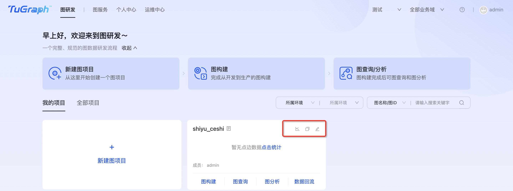

## 图编辑
点击“图编辑”，可对图项目进行基础信息修改。
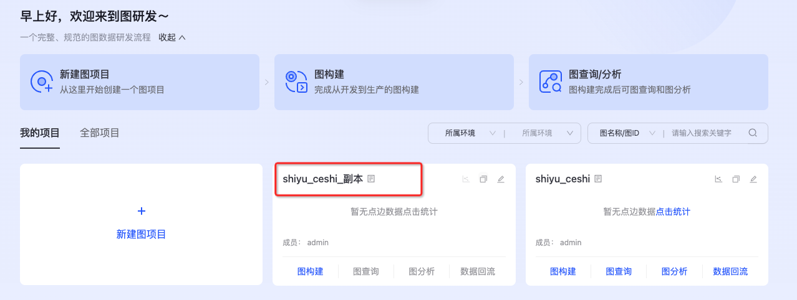

## 图复制
支持基于现有图项目快速生成另一个图项目，复制原有图项目得描述信息、权限及schema信息到草稿状态。


## 图项目搜索
支持基于所属环境、图名称/图ID、图成员进行图项目搜索，如下图所示：
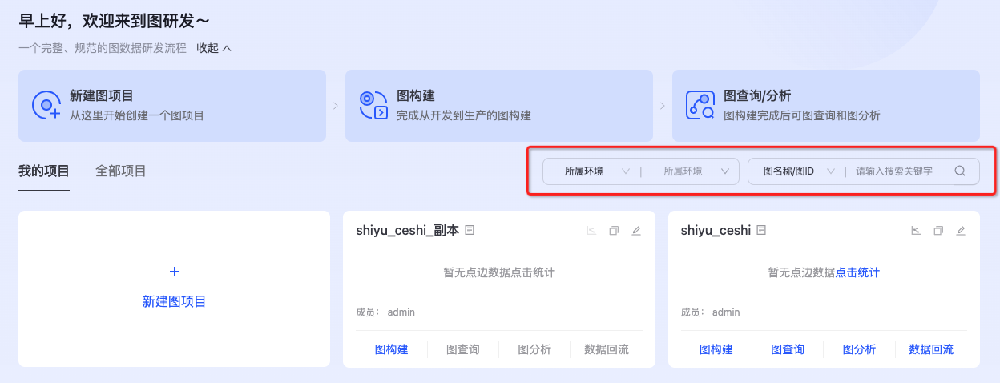

## 点边统计
图项目在绑定集群后，将点亮“点边统计”小图标，如下图所示：
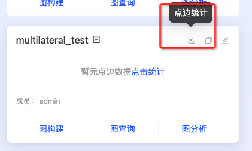
点击“点边统计”，进入点边统计配置页，如下图所示：
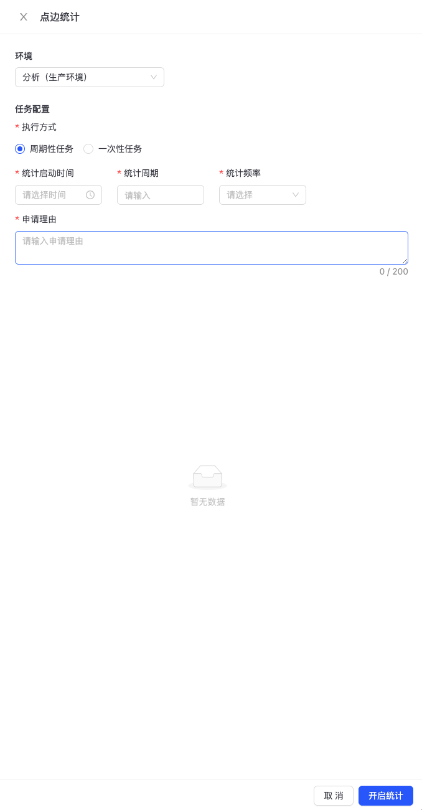
配置任务执行方式、申请理由等信息，点击“开始统计”，提交点边统计任务。您可在“运维中心-> DB运维->任务管理”中找到相应的任务，查看详情和进度。


## 查看图项目集群信息
查看图项目所属集群及实例信息。
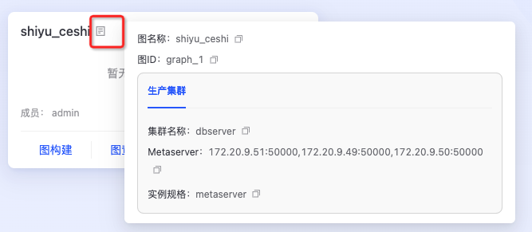

# 创建图集群
## 创建MetaServer集群
MetaServer集群主要是用于存储DB集群相关元数据信息，一个MetaServer集群可以同时挂载多个DB集群。
点击“运维中心-> DB运维->集群管理->MetaServer集群”，进入MetaServer集群管理页面，如下图所示：
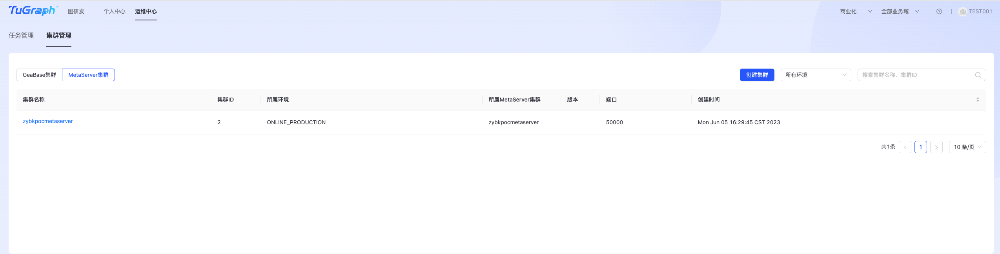
点击右上角“创建集群”按钮，进入MetaServer集群创建页面，如下图所示：
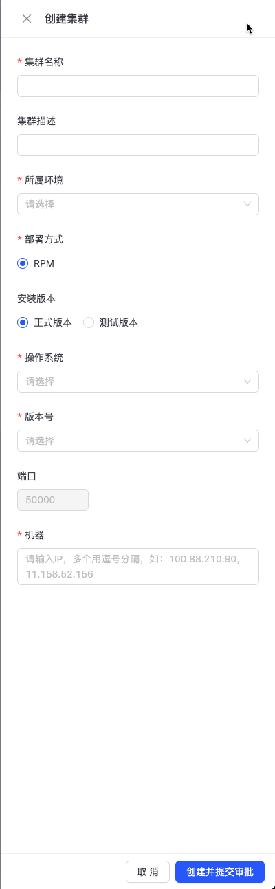
填写集群名称、机器IP，选择集群所属环境、部署方式、操作系统及版本号等信息，点击“创建并提交审批”按钮，等待管理员审批通过后，便可开始创建MetaServer集群。
注：部署方式支持RPM包及镜像两种部署方式。
您可以在“运维中心-> DB运维->任务管理”中找到相应的任务，查看任务的执行情况，如下图所示：
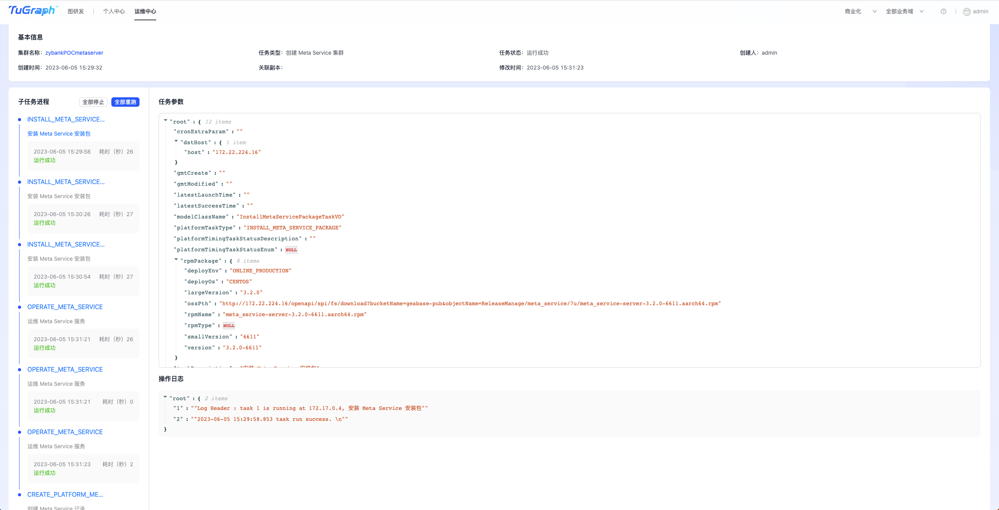

## 创建TuGraph DB集群
TuGraph DB集群主要用于存储用户图数据。
点击“运维中心->DB运维->集群管理->GeaBase集群”，进入TuGraph DB集群管理页面，如下图所示：

点击右上角“创建集群”按钮，进入TuGraph DB集群集群创建页面，如下图所示：
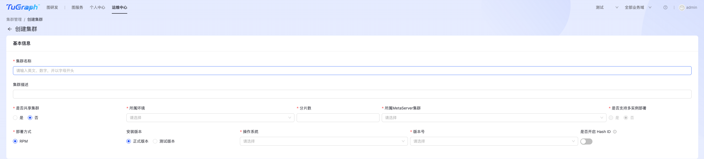
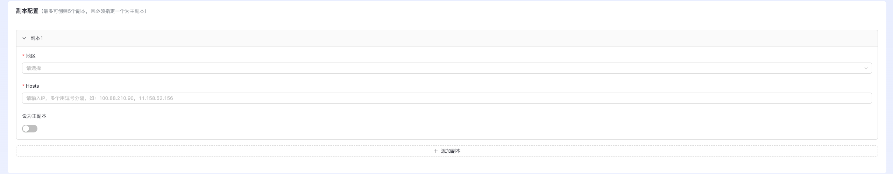
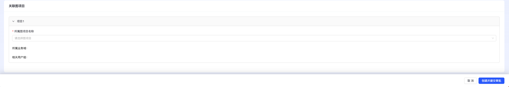
填写以下信息：

   - **基本信息：**
      - 集群名称：TuGraph DB集群名称；
      - 是否共享集群：TuGraph DB支持独立集群和共享集群两种模式，共享集群模式下支持多图；
      - 所属环境：选择环境类型，比如线上正式环境、线上灰度环境等；
      - 分片数：数据分片数量，可根据实际数据规模填写；
      - 所属MetaServer集群：选择DB集群所挂载的MetaServer集群；
      - 部署方式：支持RPM和镜像两种方式；
      - 安装版本：选择正式版和测试版；
      - 操作系统：选择部署TuGraph DB集群对应服务器的操作系统；
      - 版本号：选择部署的TuGraph DB版本；
      - 是否开启Hash ID：开启此功能可提高查询效率，但会影响数据ID的直观展示，默认关闭；
      - 端口号：默认60000
   - **副本信息（TuGraph最多可创建5个副本，且必须指定一个为主副本）**
      - 地区：选择副本所在城市；
      - Hosts：副本所在主机节点IP，支持一个副本部署在多台主机节点上；
      - 设为主副本：是否是主副本；
   - **关联图项目（独立集群在创建时必须关联图项目）**

点击“创建并提交审批”，等待管理员审批通过就会看到自己创建的TuGraph DB集群，创建过程中可以在“运维中心-> DB运维->任务管理”中找到相应的任务，查看详情和进度。


## 图项目绑定集群
TuGraph DB支持独立集群和共享集群两种模式，共享集群模式下支持多图；独立集群模式下，在创建集群时必须要关联图项目。共享集群模式下，可在后期关联图项目，图项目只有关联DB集群后才可以进行后续的模型发布等操作。
共享集群模式下，DB集群关联图项目入口如下：进入“运维中心->DB运维->集群管理->GeaBase集群”，如下图所示：
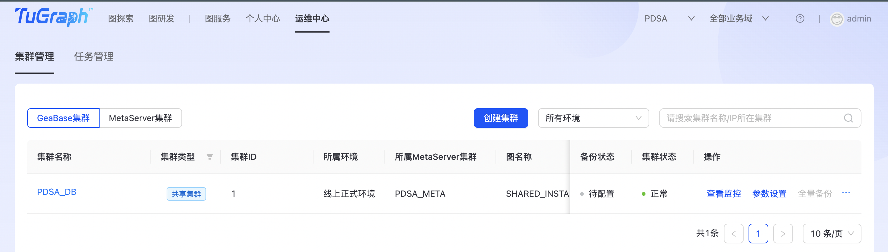
点击集群名称，进入集群详情，如下：
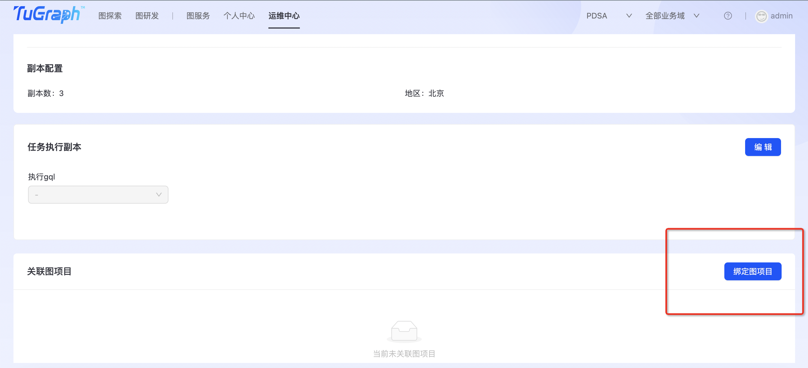
点击“绑定图项目”，如下图所示：
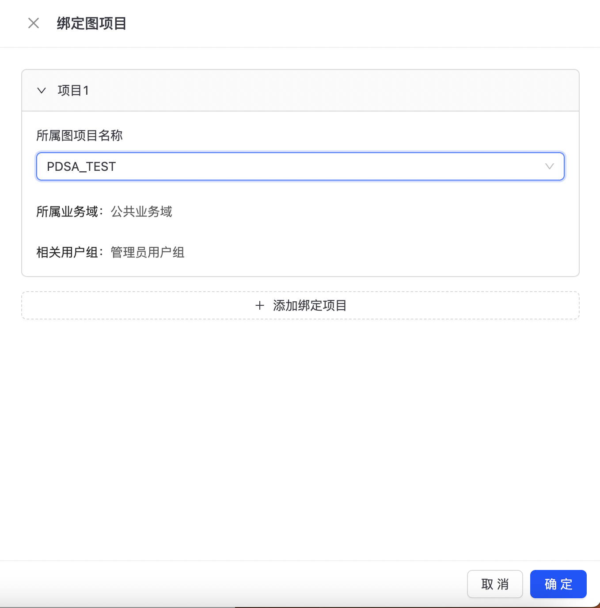
选择所属图项目，点击确定，完成图项目绑定。

# 图构建
图构建是图研发核心功能模块，通过图构建实现图实例的Schema变更管理，包括新建点（边）、删除点（边）、创建或删除索引、创建或删除ttl、修改类型名称和属性名称等功能。图构建不仅支持手动添加点（边），同时还支持根据不同的业务需求通过收藏或者导入模型文件等方式导入Schema。
## 模型定义
### 创建点
点击“图项目->图构建”进入图构建页面，您可以可通过**「添加点」、「添加边」**来构建图模型，如下图所示：
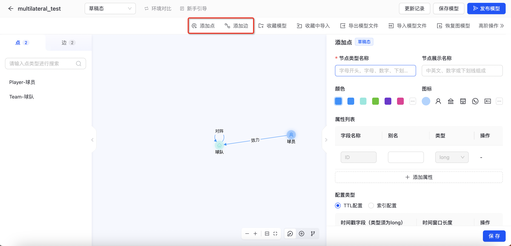

   - **添加点**

输入节点类型名称、节点展示名称、字段名称、字段别名、字段类型等，同时支持节点展示颜色及图标配置。节点信息配置完成后，点击“保存”，schema信息会保存草稿态。
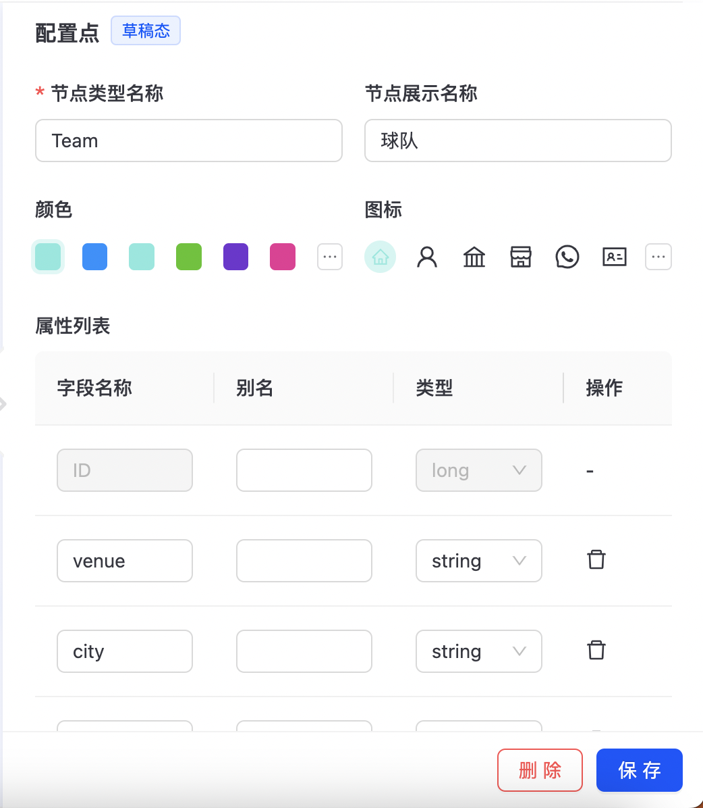
其中节点类型名称不能使用图库关键字，且命名只能使用英文字母、数字、下划线（需匹配[a-zA-Z][_a-zA-Z0-9]*)组合。

   - **添加边**

输入边类型名称、边展示名称、字段名称、字段别名、字段类型，选择起点和终点等信息，同时支持边展示颜色配置。边信息配置完成后，点击“保存”，schema信息会保存草稿态。
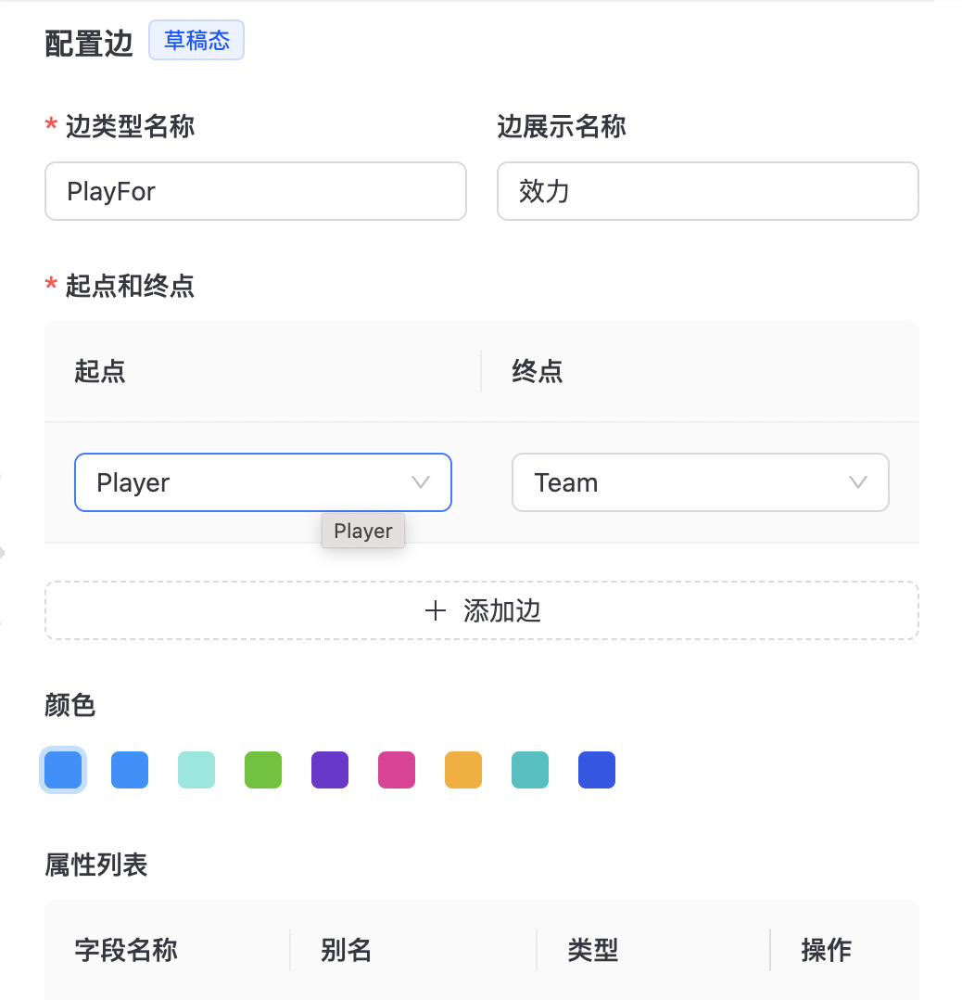


其中
（1）TuGraph支持同类型边选择不同类型起点和终点；
（2）边类型名称不能使用图库关键字，且命名只能使用英文字母、数字、下划线（需匹配[a-zA-Z][_a-zA-Z0-9]*）组合。

### 配置索引（可选）
索引是加快查询效率的重要手段之一，TuGraph Platform支持可视化构建或者删除索引。在构建完点（边）之后，可直接在配置信息中的【属性配置】来配置索引信息。注意：只能在非必填字段上构建索引。


### 配置TTL
如果需要对某一类型点（边）设置超时清理，可以指定点（边）的某个属性字段作为TTL。规则为：若该字段对应的真实时间 + TTL (时间窗口长度) < 当前时间，则保留该点（边），否则删除。根据不同的业务场景，业务可在点（边）上的字段类型为long的字段上配置TTL。
注意：
（1）一个点（边）上不能同时存在索引和TTL；
（2）只能在long类型的属性上配置TTL；
（3）每个点（边）上智能存在一个TTL。
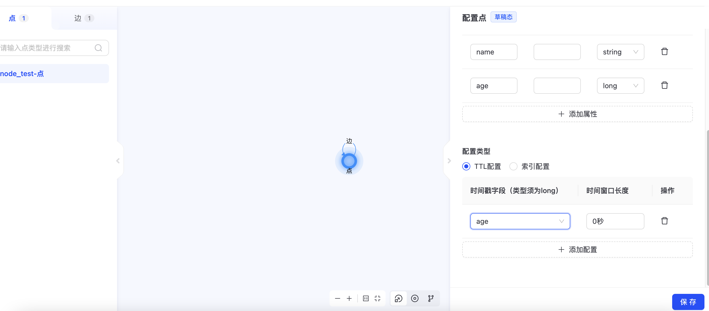


### 收藏模型
构建完模型后，若需要保存模型信息，可通过收藏模型保存模型信息。
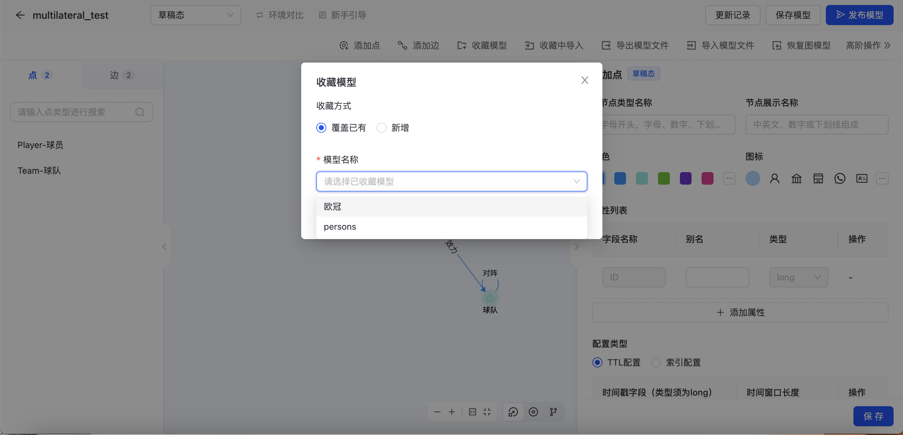
可选择“覆盖已有”模型，或者新增模型。
收藏后可在收藏夹中查看记录，如下图所示：
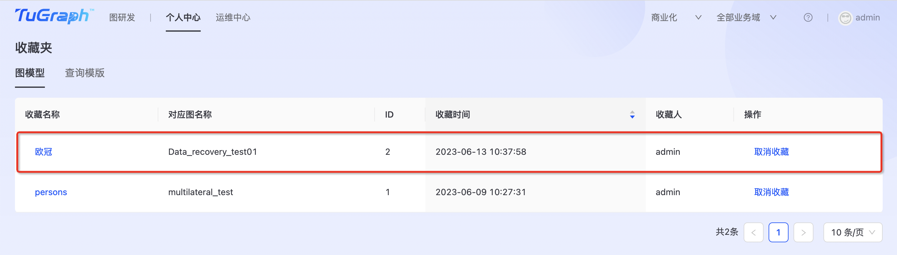

### 收藏中导入
可以通过“收藏导入”的功能，将收藏的schema导入其他模型。选择「覆盖当前画布中的模型」会清空画布上的草稿，收藏的schema会覆盖画布上的schema；否则，收藏的schema会新增到画布上，不会清空画布上的草稿。
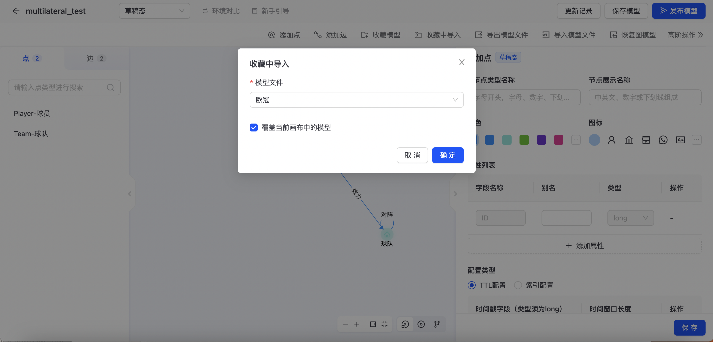

### 导出模型文件
可通过“导出模型文件”将图Schema导出为json文件，如下图所示：
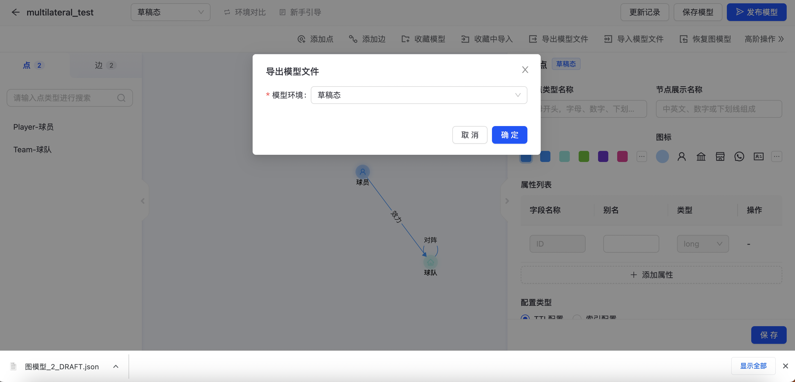

### 导入模型文件
TuGraph支持导入模型文件快速构建图模型，如下图所示：
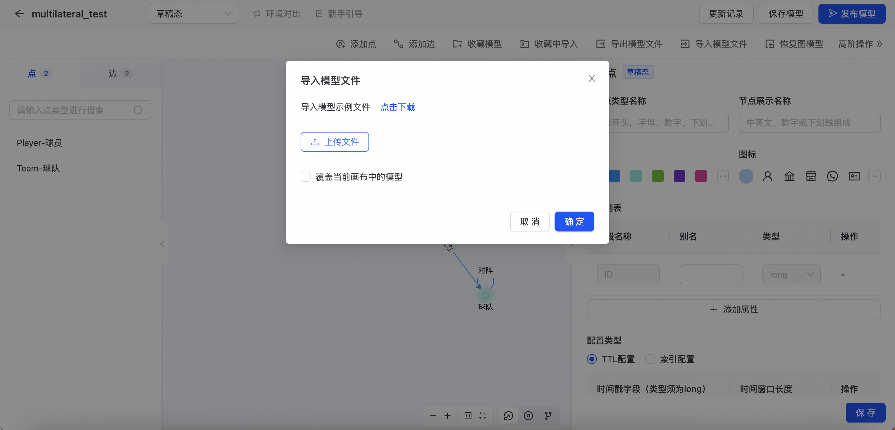
您可以点击“点击下载”下载导入模型示例文件，将模型按照示例文件进行准备后点击上传文件，完成导入。同时也可以将“导出模型文件”中所到处的模型文件，直接上传导入。

### 恢复图模型
支持从指定环境中恢复图模型，可指定需要恢复的点类型和边类型。


## 发布模型
### 发布模型
图Schema构建完成后，点击【发布模型】将Schema的变更信息下发到图实例，如下图所示：

点击【发布模型】后，需选择本次待发布的内容和选择生效到哪个环境，如下图所示：

可在该页面查看schema的变更内容，是否与预期相符合。确定完毕后，可点击「发布」将Schema变更下发到图实例。
注：建模中的所有Schema变更只会修改草稿的Schema，变更开发、灰度、生产的Schema只能通过发布模型来完成。例如，若想在生产Schema中新增一个点，步骤如下：

   1. 先在草稿中新增该点
   2. 通过发布模型【草稿】->【开发】来变更开发schema，
   3. 再通过过发布模型【开发】->【灰度】来变更灰度schema
   4. 最后通过过发布模型【灰度】->【生产】来变更生产schema
### 发布记录
发布工单提交之后，可在发布记录中查看发布状态，如下图所示：


不同生效版本的发布记录需在不同环境下查看。


可点击“更新内容”查看此次变更的具体内容：


## 数据的导入
### 离线导入
#### 映射配置
图Schema发布完成后，开始数据导入。选择点/边（可在画布中进行选择，也可以在左侧列表中选择），弹出离线导入数据源选择及映射配置页面，如下图所示：

选择相应的数据表或者本地直接上传数据表，进行数据映射配置。本地上传页面如下图所示：

选定正确的列限定符、列分隔符、编码格式等内容，点击确定完成数据文件上传。
点击“数据表选择”后进行字段映射，如下图所示：

点击“下一步”进行ID字段hash配置，原因在于DB主键需要为long，如果源数据为非long，需要进行MURMURHASH。如果是long，则选择TYPE_CAST即可。


#### 导入配置
映射配置完成后，点击“下一步”，进入导入配置页面，如下图所示：

配置相应的导入方式及开始导入日期，导入方式支持“一次性导入”、“周期性导入”两种，目前“周期性导入”对数据源有一定的要求，需要是ODPS数据源，点击“完成”生成导入数据任务。
其中“高阶参数配置”，主要是设置导入数据相关配置参数，可选择默认值。


可前往“导入任务列表”查看导入配置和导入记录，如下图所示：

可点击“编辑”，对数据导入任务进行编辑，也可以选择“立即导入”，执行导入任务。
可点击“导入记录”，查看数据导入任务失败任务详情，查看具体任务执行情况。


#### ODPS表赋权
离线导入支持ODPS表赋权链接。


### 实时导入
TuGraph Platform支持数据实时导入配置，如下图所示：


#### 选择数据源
选择相应的数据源，如果没有配置，可点击“数据源连接配置”，进入数据源配置页，如下所示：

目前支持SLS、kafka两种消息队列数据源。

   - **SLS配置**
```java

"project": "",									 //sls project
"endpoint": "",									 //sls endpoint							
"logStore": "",									 //sls log store		
"accessKeyId": "",							     //ak
"accessKeySecret": ""					         //sk

```

   - **kafka配置**


```java

"bootstrapServers": "11.238.192.1:9092",	//kafka bootstrap集群地址
"zookeeperConnect": "11.238.192.1:2181",	//kafka 依赖的zookeeper地址
"topic": "xizhi_test_102",					//订阅的topic
"groupId": "graphlink_kafka010_test_1",		//kafka 消费者的groupid
"version":"kafka_08"                        //kafka版本 （kafka_08、kafka_09、kafka_10、kafka_11）

```
| 参数 | 解释 | 获取方式 |
| --- | --- | --- |
| bootstrapServers | kafka部署节点的地址 | 根据kafka部署拓扑填写，格式如127.0.0.1:9092,127.0.0.2:9092,127.0.0.3:9092 |
| zookeeperConnect | kafka部署集群依赖zookeeper的地址 | 根据依赖zookeeper集群的部署拓扑填写，如127.0.0.1:2181,127.0.0.2:2181,127.0.0.3:2181 |
| topic | 订阅kafka主题名 | 请预先创建好topic |
| groupId | kafka客户端所属消费组 | 请根据实际业务场景填写groupId |
| version | kafka集群版本 | 兼容version如下
 |

点击“测试连接”，可对所配置数据源进行测试，测试成功后，点击“提交”，完成数据源配置。


   - **GeaBase WAL**


#### 配置数据源映射和导入参数

依据“说明文档”完成数据源映射和导入参数配置。
### 批量导入
#### 数据源及映射配置
针对点变类型特别多的场景，系统支持批量导入功能，点击“批量导入”进入其页面，如下图所示：

选择相应的数据源后，进行数据源映射配置，批量点导入：必须映射 ID、点类型、点属性这三个字段。

批量边导入：必须映射 SRCID、DSTID、TIMESTAMP、边类型、点属性 这几个字段。

#### 选择分区类型

- 条件配置 且/或 相当于运算符 and/or
- 你可以配置时间条件组,非时间条件组，组成分区条件进行分区的过滤。
- 时间条件组需要选择 时间分区，时间分区格式，实时度。


#### 配置高阶参数
系统默认展示六个常用参数，如下图所示：


#### 查看导入列表


# 图查询
图查询主要面向技术研发人员，向其提供图查询、开发调试等功能，调试成功后可发布到生产环境。图查询入口如下图所示：

点击“图查询”，进入图查询页，如下图所示：


## 文件夹
一开始新项目无文件夹的情况下，系统默认会新建默认文件夹和默认语句，用户可自行重命名；在「语句查询」右侧点击“+”可以创建文件夹，

在文件夹旁边点击“+”可添加语句。


   1. 文件夹名称：不超过20字符，只限中英文、数字、字母。
   2. 文件夹右侧操作有：
      1. 重命名，点击后文件夹名称处于可编辑模式
      2. 删除，点击后跳出二次确认弹框，提示“文件夹下的查询都将被删除，是否继续？”点确定，删除文件夹及其子项所有内容。

## 语句执行
### 语句查询
单击查询名称，右侧分上下两个模块：语句输入框、执行结果/历史展示，如下图所示：


- **执行：**
   1. 直接点击“执行”：默认将编辑器里的所有语句进行执行；
   2. 选中编辑器中某几行代码进行执行
- **保存：**将当前编辑器中的语句内容进行保存到当前选中的语句，下次进入还能看到最近一次的最新内容。

若执行成功，执行结果共4类展示形式，都支持结果下载，分别为：

- **执行结果**
   1. JSON视图


   2. JSON文本


      1. 点边列表


   3. 点边视图


- **执行历史**

可查看历史的执行记录，点击查询语句会复制查询语句，查询语句、创建人列支持筛选，如下图所示：


### 插入数据
在开发环境，支持语句插入（其他环境暂未开放），有两种方式可以实现：

   - **在编辑器编写插入语句并执行**


   - **在「插入数据」窗口中使用图形界面插入语句**


### 哈希计算
针对原始点或边ID为字符串的情况，支持将字符串转换为long，如下图所示：


### 阈值设置
支持限制返回到前端的记录条数，防止在大数据量情况下导致前端崩溃，如下图所示：


### 副本设置
支持对指定副本进行数据查询，点击“副本设置”，弹出副本设置页面，如下图所示：


### 语句下载
支持将查询语句保存到本地文件，点击“下载语句”完成下载操作。


### 查看图模型
打开右上角「查看模型」可查看图模型，在「列表」tab 可查看最新的点边统计信息，在「图谱」tab 可显示可视化的图模型。如下图所示：


### 生成模板
点击“生成模板”图标，可创建查询模板，如下图所示：

模板配置页面如下图所示：


配置模板名称及参数，点击确定，完成模板添加。


## 查询模板
### 导入查询模板
查询模板支持2种导入方式：1） 从收藏中导入，2）本地导入；


### 收藏和删除
查询模板右侧操作支持：
**收藏：**收藏到个人中心，可在其他图项目的图查询中导入使用，覆盖已有的收藏，或者新增收藏，逻辑同新版图分析的模板收藏。

**删除：**点击后跳出二次确认弹框，提示“查询模板将被删除，是否继续？”点确定，删除其语句内容。


# 图分析
点击“图项目->图分析”进入图可视化分析页面，如下图所示：

图分析模块由4个部分组成：

   1. **全局查询：**通过全局查询出一部分种子节点进行分析
   2. **画布工具栏：**选中单个节点或通过套索圈中多个节点后的批量分析操作
   3. **分析导航栏：**通过套索圈中多个节点后的批量分析操作
   4. **节点右击菜单：**针对单个节点的分析操作

您可以通过TuGraph Platform的图分析模块进行实时的可视化图查询、图分析、开发调试、图特征开发、自定义图应用，发布嵌入等操作。

   - **实时的可视化图查询与图分析**
      1. **实时的图查询：**实时返回查询结果，结果图谱化展示。查询方式支持：
         1. **配置查询：**通过查询节点类型、属性类型、过滤条件等配置，查出图数据
         2. **语句查询：**通过写ISO_GQL语句查询图数据
         3. **模板查询：**基于自定义模板快捷查询
         4. **路径分析：查询两个节点之间的最短路径和全部路径**
         5. **环路检测：检测指定的一个或两个节点是否在环路中，并查询所在的环路**
      2. **丰富多样的图分析能力：**全局的配置查询、语句查询、模板查询、路径分析、画布工具栏、外观配置、分组、聚合、共同邻居、重要节点、模式匹配、自定义可疑标签、涉黑判断（加入黑名单&白名单）、保存分析、我的分析模块，样式模板、超链跳转配置、配置管理、发布嵌入、大点巡检&删除等。
      3. **分析结果沉淀：**将分析结果保存沉淀至「我的分析」模块，便于后续验证、分享、再次分析等。
   - **图特征的开发**
      - 通过编写ISO_GQL语句查询的方式，查出特征数据，验证特征结果是否符合期望。
      - 配置查询：通过查询节点类型、属性类型、过滤条件等配置信息的定义，查出特征数据，验证特征结果是否符合期望。
      - 生成模板，供业务在查询模板中使用。
   - **一键集成**
      - 可以快速被业务应用集成，可直接将功能模块发布嵌入至第三方业务系统中；

## 全局查询
支持通过全局查询出一部分种子节点后进行图可视化分析，有五种开始开始方式：配置查询、语句查询、模板查询、路径查询、环路查询。
### 配置查询
支持边/点类型筛选（点/边名称）、扩散度数配置、边方向（入度、出度、双向）、点/边上的属性过滤（点/边属性判断）、返回结果数限制等。


### 语句查询
支持编写ISO-GQL查询语言进行查询分析，如下图所示：

并支持直接将查询语句“发布成模板”。

### 模板查询
支持基于以发布的模板进行查询，输入相应的模板参数，点击“查询”，执行相应查询语句。


### 路径查询
支持基于起点节点和终点节点间的所路径查询分析，包含最短路径及全部路径，支持深度配置，如下图所示：


### 环路查询
支持检测指定的一个或两个节点是否在环路中，并查询所在的环路，如下图所示：


### 结果展示-视图切换
全局查询的结果展示支持三种视图：图谱视图、列表视图、JSON视图，如下图，可切换成不成视图展示。


## 画布工具栏-图谱视图

### 定位搜索
针对画布中的点进行定位聚焦，点击图中搜索按钮，如下图所示：

弹出定位搜索框，支持按照节点/边ID、属性等进行定位搜索，如下图所示：

点击“确定”后会进行高亮显示，如下图所示：


### 放大/缩小/1:1/居中/下载图片/清空画布

   - **放大：**点击放大画布内容
   - **缩小：**点击缩小画布内容
   - **1:1：**点击切换为1：1比例
   - **居中：**点击画布居中显示
   - **下载图片：**点击将画布内容下载为png格式图片
   - **清空画布：**点击清空画布内容


### 切换至地图

### 开启图例
显示画布的点边类型及其图标，如下图所示：


### 套索
支持多次套索，**Shift+鼠标单击可圈选多次，过程中可单击移动点边。**


### 过滤
支持画布过滤功能，如下图所示：

点击“过滤”图标，弹出过滤配置页面，如下图所示：


### 高亮
高亮单个/多个节点，一般用于特殊/可疑节点的分析；可取消高亮。
单个：选中后右击菜单里选高亮，当前节点底层变亮；在右击菜单了可取消高亮；
多个：点击套索，按住shift圈中多个节点，选中后在工具栏里选高亮再次选中后，在工具栏里点取消高亮图标，可取消高亮。


### 锁定
支持锁定某节点，使其不可拖拽；可解锁。
单个：选中节点后右击，在右击菜单里选锁定。
多个：点击套索，按住shift圈中多个节点，选中节点后在工具栏里选锁定，使其不可拖拽，再次选择后点“解锁图标”可解锁。


## 分析导航栏-图谱视图

### 查找添加
支持在当前画布元素不变的前提下，通过“查找添加”往画布中追加节点进行分析。如下图所示：


支持基础配置模式和高级语句模式。

   - **基础模式**


   - **高级模式（通过查询语言添加）**


### 画布详情
显示当前画布数据详情，如下图所示：


### 外观
支持可视化配置点/边展示样式及风格，如下图所示：


### 饼图


### 布局
支持多种布局形式，如下图所示：


### 分组
在按自定义条件进行分组基础上，新增圆形和方形切换、按分组聚合、恢复原状


### 聚合
新增圈选聚合、取消&展开聚合、聚合面板展示聚合后数据详情。


### 扩散
针对选中的单个/多个点，进行自定义关系扩散。默认一度扩散，可扩散到三度，支持自定义扩散度数配置、边方向（入度、出度、双向）、点/边上的属性过滤（点/边属性判断）、自定义返回结果数限制等。


### 边合并
针对起点、终点、边类型相同的多条边聚合成一条。


### 标签
支持为节点添加标签，如下图所示：

可支持标签相应操作，比如隐藏、删除、显示等，如下图所示：


### 分析
支持节点重要性、路径分析、筛选分析、共同邻居和模式匹配五种分析方式。
#### 节点重要性
支持画布节点重要性分析，支持算法包括PageRank、度数中心性、出度中心性及入度中心性等，如下图所示：

点击“分析”显示具体分析结果：


#### 路径分析
针对画布已有数据的两点间最短路径进行分析，如下图所示：

点击分析，查看具体分析结果


#### 筛选分析
支持自定义筛选器，针对条件统计画布数据分布情况。


#### 共同邻居
在点选基础上，支持同时圈选多个对象查找邻居，支持查找度数、数据时间范围的配置，如下图所示：

点击“高级筛选”，可进行关系类型及其属性过滤条件配置，如下图所示：

点击“开始查找”，展示共同邻居情况，如下图所示：

点击“查看”可在画布突出显示该节点，如下图所示：


#### 模式匹配
平台支持自定义业务模式，并可保存为模式模板，支持用户基于模板查询。进入模式匹配分析，如下所示：

若没有模式，可点击“没有模式？”进入新建模式页面，如下所示：

支持顶点和边条件配置，顶点/边配置如下图所示：

保存后，点击匹配，获取匹配结果，如下图所示：


### 保存样式
在外观配置基础上，保存饼图、布局、分组、聚合等样式，如下图所示：

保存后，「配置管理」样式模板里修改，如下图所示：


### 保存分析
分析结果沉淀：将分析结果保存沉淀至「我的分析」模块，便于后续验证、分享、再次分析等。


### 发布
点击“发布”按钮，分析结果快速被业务应用集成，可直接将功能模块发布嵌入至第三方业务系统中，如下图所示：


### 导出
点击“导出”按钮，支持将画布内容导出为png文件、json文件，如下图所示：


### 配置


#### 地图配置

#### 模板配置
支持查询模板的新增、删除、修改等操作。


#### 样式配置
支持自定义样式配置，定义节点、边的展示样式。


#### 模式配置
针对模式匹配模板的新增、修改和删除配置。


#### 超链跳转配置
针对超链跳转配置新增、删除、修改。


#### 自定义
自定义画布导航的功能按钮、全局配置等内容


## 节点操作-图谱视图

### 属性面板
单击某节点出现该节点属性面板，可查看该节点具体详情，如下图所示：


### 扩展查询
默认将当前选中节点，自动扩展出一度、二度、三度邻居节点，如下图所示：


### 添加标签
选中单个节点后，点击添加标签，在弹框里填写标签名称、选择标签颜色，如下图所示：

添加完成后，画布显示标签内容：

在右击菜单栏中删除已有标签，如下图所示：


### 加入名单
加入名单->名单管理（支持单个或批量操作）
加入黑名单：加入后出现在详情
加入白名单


### 移除名单
移除名单：在右击菜单栏中移除已有名单


### 高亮
一般用于特殊/可疑节点的分析；可取消高亮。
选中后右击菜单里选高亮，当前节点底层变亮；在右击菜单了可取消高亮


### 锁定
选中节点后，右击菜单里点击锁定使其不可拖拽；解锁：针对已锁定的节点，右击菜单里可解锁。


# 图服务
## 算法服务
TuGraph支持可视化方式进行算法执行与调用，目前提供6个经典图算法（后续支持更多内置算法）的任务配置和结果查看、分析功能。
点击“图服务->算法服务”进入算法服务配置管理页面，如下图所示：

点击“新建算法服务”，进入算法服务配置，如下图所示：

### 数据选择

输入算法任务名称，选择数据源类型，目前支持读取图数据库和本地文件两种方式。

   - **GeaBase**

选择数据类型为GeaBase实，需选择图名称，并选择点类型、边类型。


   - **本地文件**


### 算法配置
目前支持六中内置算法，如下图所示：


   - **广度优先搜索（BFS）**

BFS是最简便的图搜索算法之一，属于一种盲目搜寻法，目的是系统地展开并检查途中的所有节点，以找寻结果。换句话说，它并不考虑结果的可能位置，彻底的搜索整张图，直到找到结果为止；


   - **网页排序（PAGERANK）**

PageRank算法是在图上执行一个随机游走模型，根据随机游走者，在有向图上，通过对节点访问次数或访问概率的高低来判断有向图上各个节点的重要程度；


   - **单源最短路径（SSSP）**

SSSP算法的核心思路就是按着路径递增计算，来确定单源最短路径；


   - **弱连通分量（WCC）：**

WCC算法会计算图中所有的弱连通分量。同一弱连通分量里的任意两个点，保证至少一方能到达另一方；


   - **标签传播（CDLP）**

CDLP算法是最早的基于标签的一种算法，是所有基于标签的算法的基础。CDLP算法最大的特色是简单、高效，缺点是每次迭代结果不稳定，准确率不高；


   - **集聚系数（LCC）**

LCC算法是一种基于节点邻域信息的社区发现算法，主要用于发现局部社区结构。该算法通过计算每个节点的邻居节点之间的相似性来划分社区。具体来说，算法首先选取一个节点，然后根据节点的邻居节点构建一个子图，并计算子图内节点之间的相似度。接着，通过聚类算法将相似度高的节点分为一个社区。算法重复执行直至所有节点都被划分到社区中。相比于其他社区发现算法，LCC算法具有计算复杂度低、效果稳定等优点。


### 输出配置
支持将算法结果输出到图数据库和本地文件。

   - **写入GeaBase**


   - **本地文件**


# 个人中心
## 工单管理
TuGraph Platform平台的功能权限、数据权限等，需通过平台的工单系统完成审批和授权。对于申请人来说，可以通过平台的工单管理模块来跟踪工单的进度、寻找审批人；对于审批人来说，可以通过工单管理模块推进工单的进度。
### 创建工单
工单的创建入口散落在平台不同的功能子模块中，当用到平台的某些功能时，会引导用户创建工单。以平台权限管理-创建用户组为例，在表单中填写必要的参数，点击“创建并提交审批”即可生成工单。


### 我提交的
在平台【个人中心】->【工单管理】->【我提交的】选项卡下可以看到自己申请的工单列表。工单列表指示了工单号、工单类型、工单状态等信息。对于状态为“等待审批”和“审批中”的工单，用户可以点击【撤回】按钮来取消目标工单，撤回的工单审批人将不可见。

用户可以根据工单类型、审批人、工单状态对工单进行筛选，也可以根据申请时间、审批时间对工单进行排序，以便于快速找到目标工单。

除了过滤工单外，用户还可以在右上角的搜索框中输入工单号、工单类型、审批人工号、审批人名称、图名称进行工单的模糊搜索。
点击“查看详情”可以查看工单详情，工单详情界面展示了待申请工单的详细信息和审批进度。如下图所示：


### 我审批的
在平台【运维管理】->【工单管理】->【我审批的】选项卡下可以看到自己有权限审批的工单列表。


## 数据列表
在图构建里配置完图结构(Schema)后，我们需要选取相关数据导入到配置好的图结构(Schema)中用于后续的查询、分析。**数据管理**主要用于管理这些相关数据。
点击“个人中心->数据列表”进入数据列表管理页面，如下图所示：

平台支持离线数据和实时数据两种方式。

### 离线数据
点击“个人中心->数据列表->离线数据”进入离线数据列表页面，如下图所示：


#### 本地上传
点击“本地上传”按钮，进入离线数据文件上传配置管理页面，如下图所示：


选择要上传的文件，目前支持csv、txt文件格式，选择**文件用途、列限定符**、**编码格式**、**所属的业务域**和**用户组**等信息，点击“确定”，完成文件上传。

#### ODPS表赋权

#### 数据预览
点击“表名/文件名”可查看数据文件数据预览内容，如下图所示：


#### 大文件上传
请通过ssh/ftp客户端，将大文件的文件夹放置到/home/admin/geamaker-fs/geabase-pub/customized目录下，文件夹里放置文件数据即可。


填写完毕后，点击确定，完成大文件上传。

#### 编辑与删除
点击“编辑”按钮，可修改数据文件上传配置信息，如下图所示：

点击“删除”，删除数据源配置，点击“确定并提交审批”，完成数据源删除。


### 实时数据
点击“个人中心->数据列表->实时数据”进入实时数据列表页面，如下图所示：

点击“数据源连接配置”，进入数据源配置页面，目前支持sls、kafka两种数据源，如下图所示：


#### SLS配置
```java

"project": "",									 //sls project
"endpoint": "",									 //sls endpoint							
"logStore": "",									 //sls log store		
"accessKeyId": "",							     //ak
"accessKeySecret": ""					         //sk

```

#### kafka配置

```java

"bootstrapServers": "11.238.192.1:9092",	//kafka bootstrap集群地址
"zookeeperConnect": "11.238.192.1:2181",	//kafka 依赖的zookeeper地址
"topic": "xizhi_test_102",					//订阅的topic
"groupId": "graphlink_kafka010_test_1",		//kafka 消费者的groupid
"version":"kafka_08"                        //kafka版本 （kafka_08、kafka_09、kafka_10、kafka_11）

```
| 参数 | 解释 | 获取方式 |
| --- | --- | --- |
| bootstrapServers | kafka部署节点的地址 | 根据kafka部署拓扑填写，格式如127.0.0.1:9092,127.0.0.2:9092,127.0.0.3:9092 |
| zookeeperConnect | kafka部署集群依赖zookeeper的地址 | 根据依赖zookeeper集群的部署拓扑填写，如127.0.0.1:2181,127.0.0.2:2181,127.0.0.3:2181 |
| topic | 订阅kafka主题名 | 请预先创建好topic |
| groupId | kafka客户端所属消费组 | 请根据实际业务场景填写groupId |
| version | kafka集群版本 | 兼容version如下
 |

点击“测试连接”，可对所配置数据源进行测试，测试成功后，点击“提交”，完成数据源配置。


#### GeaBase WAL

## 名单列表
名单管理主要用于支持用户对特定的实体（Vertex）进行标记，便于对这些实体（Vertex）进行单独的确认及处理。当前主要支持2种场景的名单管理。

- **黑名单**：用户根据自己图分析结果，对于部分可疑或者异常实体（如风控交易的欺诈账户），录入该名单，后续访问过程可针对性处理；
- **白名单**：用户根据自己分析结果，确认部分用户为优质用户（如风控交易识别出某活跃合法用户），可以针对性的做性能优化；
### 黑名单
点击“个人中心->名单列表->黑名单”进入黑名单管理页面，如下图所示：


#### 新建黑名单
平台支持“手工新建”、“本地上传”两种方式新建黑名单。

   - **手工新建**

点击“新建名单->手工新建”，进入手工新建黑名单页面，如下图所示：


填写相应信息，点击确定，完成黑名单创建。

   - **本地上传**

点击“新建名单->本地上传”，进入本地上传黑名单配置页，如下图所示：


填写相应信息，点击确定，完成黑名单本地文件上传。

#### 取消录黑
平台支持取消录黑和批量取消录黑，如下图所示：


### 白名单
点击“个人中心->名单列表->白名单”进入白名单管理页面，如下图所示：


#### 新建白名单
平台支持“手工新建”、“本地上传”两种方式新建白名单。

   - **手工新建**

点击“新建名单->手工新建”，进入手工新建白名单页面，如下图所示：


填写相应信息，点击确定，完成白名单创建。

   - **本地上传**

点击“新建名单->本地上传”，进入本地上传白名单配置页，如下图所示：


填写相应信息，点击确定，完成白名单本地文件上传。

#### 取消录白
平台支持取消录白和批量取消录白，如下图所示：


## 收藏夹
您可以将自身认为有价值的模板收藏起来，便于后续产品使用过程中直接引用或给到其他人员使用。目前平台提供的收藏模板包含以下两种：

1. 图模型（Schema）模板
2. 查询模板
### 图模型
点击“个人中心->收藏夹->图模型”，进入图模型收藏夹页面，如下图所示：

点击“收藏名称”，可展示所收藏图模型详细信息，如下图所示：

点击“取消收藏”，确定后取消收藏图模型。


### 查询模板
点击“个人中心->收藏夹->查询模板”进入查询模板收藏夹页面，如下图所示：

点击“收藏名称”，展示查询模板详细信息，如下图所示：

点击“取消收藏”，确定后取消查询模板收藏。


## 用户组和权限
详见“2.2.2. 用户组”。

## 业务域管理
详见“2.2.3. 业务域管理”。

## 我的分析
图分析中保存的分析可在我的分析中查看，并再次进行分析。


# 运维中心
## 任务管理
任务管理主要是用于查看和管理所有的异步任务，用户可以对任务进行跟踪和操作。点击“运维中心->DB运维->任务管理”进入任务管理页面，如下图所示：


### 任务筛选
平台支持通过所属环境、任务类型、任务状态、集群名称、创建人多种条件组合，点击“查询”后即可筛选出符合条件的任务列表。任务列表会显示任务ID、任务的集群名、任务类型、状态、创建人、创建时间等信息。


### 任务详情
点击蓝色的任务ID，进入任务详情界面。如下图所示：


其中“基本信息”栏展示了任务关联的集群、当前状态等信息。
“子任务进程”展示了当前任务的所有子步骤，以及子步骤当前的状态。单击某个字步骤可以展示子步骤运行时的参数和执行日志。点击“全部停止”可以终止当前任务。任务执行异常时，点击“全部重跑”可以重新执行任务。
### 常见任务触发入口
#### 离线数据导入任务
点开图卡片，进去“图构建”模块，选中需要导入的点边，配置好导入日期后，点击“完成”即可在设定时间触发数据导入任务。


也可以点击“导入任务列表”，点击立即导入，即可立刻执行数据导入任务。


#### 创建集群
在运维中心-集群管理中，点击“创建集群”按钮，进入创建集群表单。填写表单，点击“创建并提交审批”按钮，即可立即发起创建集群任务。


#### 点边统计
点击图卡片的“点边统计”按钮，即可进入点边统计配置界面。

填写点边统计任务的触发频率，点击“开启统计”，即可在设定的时间拉起点边统计任务。


#### 增加副本
进入运维中心-DB运维-集群管理，点击目标集群进入详情页，点击“添加副本”按钮。

填写添加副本表单，点击“添加并提交审批”按钮，即可拉起增加副本任务。


#### 修改副本流量
进入运维管理-集群管理，进入目标集群详情页，点击“修改流量”按钮，设置好期望的流量权重后点击“确定”，即可拉起修改流量任务。


#### 修改副本角色
进入目标集群详情页，点击“修改角色”按钮，选择副本的角色，点击“确定”即可拉起切换角色任务。


#### 副本机器的重启、停止、版本更换、扩容、副本删除
进入集群详情页，点击“...”进入副本操作选项卡，点击“全部启动”会拉起目标副本下所有机器的TuGraph DB进程；点击“全部停止”会使目标副本下所有机器的TuGraph DB进程停止；点击“更换版本”可以把目标副本下的机器部署指定版本的TuGraph DB镜像；点击“扩容”可以在目标副本下增加机器；点击“删除副本”可以拉起副本删除任务，删除目标副本。


#### 管理分片Leader
进入集群详情页，点击“管理分片”。“Appoint Leader”可以指定目标副本为分片leader；“Migrate Leader”可以将起始副本的leader迁移到目标leader上；“Balance Leader”可以将分片Leader转移到不同的leader上。


#### 单台DB机器的操作
进入集群详情页，点击副本，可以看到副本下所有的机器，“操作”栏下面可以对单台机器进行操作。“启动”可以在机器上拉起TuGraph DB机器；“重启”可以重启机器；“停止”可以停止TuGraph DB机器；“更新版本”可以变更TuGraph DB镜像版本；“替换机器”可以替换指定的机器。


#### DDL任务
DDL任务可以变更图Schema。进入目标图卡片，点击目标点边，可以为目标点边增减属性，修改完属性后点击保存，然后点击发布模型。即可拉起DDL任务。


#### 创建MetaServer集群任务
点击集群管理-MetaServer集群，填写创建MetaServer集群表单，点击“创建并提交审批”即可拉起创建MetaServer集群任务。


#### 操作MetaServer
进入集群管理-MetaServer集群，进入集群详情页，可以对MetaServer机器进行切主、升级、启动、停止、扩容等操作。


## 集群管理
“集群管理”模块的作用主要是对集群进行创建，修改，停用等操作，通过可视化白屏的形式，让用户快速的维护自己的服务集群。
主要分为两类集群：TuGraph DB集群和MetaServer集群

   - TuGraph DB集群主要用来存储用户的实例数据；
   - MetaServer集群则是用来存储TuGraph DB集群相关的元数据信息；

注：创建TuGraph DB集群需要挂载在一个MetaServer集群下，一个MetaServer集群可以挂载多个TuGraph DB集群。
### TuGraph DB集群
#### 创建TuGraph DB集群
TuGraph DB集群主要用于存储用户图数据。
点击“运维中心-> DB运维->集群管理->GeaBase集群”，进入TuGraph DB集群管理页面，如下图所示：

点击右上角“创建集群”按钮，进入TuGraph DB集群集群创建页面，如下图所示：


填写以下信息：

   - **基本信息：**
      - 集群名称：TuGraph DB集群名称；
      - 是否共享集群：TuGraph DB支持独立集群和共享集群两种模式，共享集群模式下支持多图；
      - 所属环境：选择环境类型，比如线上正式环境、线上灰度环境等；
      - 分片数：数据分片数量，可根据实际数据规模填写；
      - 所属MetaServer集群：选择DB集群所挂载的MetaServer集群；
      - 是否开启Hash ID：开启此功能可提高查询效率，但会影响数据ID的直观展示，默认关闭；
      - 端口号：默认60000
   - **副本信息（TuGraph最多可创建5个副本，且必须指定一个为主副本）**
      - 地区：选择副本所在城市；
      - Hosts：副本所在主机节点IP，支持一个副本部署在多台主机节点上；
      - 设为主副本：是否是主副本；
   - **关联图项目（独立集群在创建时必须关联图项目）**

点击“创建并提交审批”，等待管理员审批通过就会看到自己创建的TuGraph DB集群，创建过程中可以在“运维中心-> TuGraph DB运维->任务管理”中找到相应的任务，查看详情和进度。


#### 查看TuGraph DB集群

点击上图集群名称，进入集群详情页面，如下图所示：

   - **基本信息**


   - **任务执行副本**


   - **关联图项目**


   - **机器列表**


   - **图模型**
- 
   - **全局配置**


   - **任务配置**


#### TuGraph DB集群操作
##### 副本操作
副本支持添加副本、扩容、删除等操作，如下图所示：


   - **管理分片**

支持指定Raft Leader、迁移leader、平衡leader功能。


   - **添加副本**

点击列表右上方的“添加副本”，进入副本添加配置页面，如下图所示：

填写副本版本、地区、机器IP、是否主副本等信息，点击“添加并提交审批”，审批完成后，平台自动添加副本。

##### 参数配置
集群整体参数配置，如下图所示：


##### 机器操作
机器支持的操作有：重启、停止、扩容、副本删除等。


##### 图模型预览
点击图模型，可以查看当前TuGrap DB集群的图模型，如下图所示：


##### 全局配置
点击“全局配置”，可查看全局变量配置信息。

点击“修改配置”可对配置项信息进行，如下图所示：


##### 周期性任务配置
周期性任务配置记录TuGraph DB集群相关的所有周期性任务配置。
用户侧：用户可以创建“点边统计”任务，创建相关配置详见“3.5. 点边统计”操作文档。
运维侧：DBA可以创建“default_compaction”、“TTL_filter”、“TS_filter”三类任务
点击“任务配置”，进入任务配置页面，如下图所是：

点击“创建任务”，进入任务创建配置页面，如下图所示：

填写配置信息并点击“添加并提交审批”，待审批完成后，平台将自动执行任务。

   - TTL 类型支持以下三种：
      - “TTL_filter”：删除某属性ttl标记过期数据
      - “TS_filter”：删除边标记过期数据
      - ”default compaction“：不删除过期数据，只是做数据压缩
   - 是否忽略切主副本：
      - “否，切换”：如果当前副本为主副本，则会将主副本切换到“可切主副本”中就近选择离当前机房最近的副本
      - “是，不切换”：在主副本副本执行，可能会引起业务抖动
   - 磁盘大小阈值：当磁盘使用空间低于80% 才允许执行
   - 副本配置支持多个批次串行执行
      - 所在地区唯一副本是否执行，如果选择「否」，表示当一个地区只有一个副本的情况下，这个副本将不执行。
##### 删除DB集群数据
点击下图“删除数据”，进行数据删除操作。数据数据，仅删除数据，但不删除Schema。

目前支持快速删除全部数据，如下图所示：

删除数据任务执行情况如下图所示：


##### 删除DB集群
删除集群将集群所有关联信息（Schema/数据/任务等）都将被删除，因此需要慎重执行，如下图所示：


##### 更新版本
TuGraph支持在线升级，目前支持副本级别、节点级别在线升级。在进行在线升级时，需要leader副本切走，当前升级的副本不能有sharder leader。

   - **副本级别在线升级：**


点击上图“更换版本”，进行整个副本的在线升级，如下图所示：


   - **节点级别在线升级：**


进入到单一节点后，点击“更新版本”，进行单个节点的在线升级，如下图所示：


##### 重启
支持副本重启和单一节点重启，如下图所示：
副本停止和启动：

单一节点重启：


##### 扩容
支持在线扩容，扩容副本需要无sharder leader，如下图所示：

点击“扩容”，进入扩容页面，如下图所示：


##### 管理分片leader

点击“管理分片leader”进入主页面，如下图所示：

Appoint Leader：指定分片Leader；
Migrate Leader：迁移分片Leader；
Balance Leader：均衡分片Leader；

### MetaServer集群
点击“运维中心-> DB运维->集群管理->MetaServer集群”，进入MetaServer集群管理页面，如下图所示：


#### 创建MetaServer集群
点击“创建集群”，进入MetaServer集群创建配置页面，如下图所示：


填写集群名称、机器IP，选择集群所属环境、操作系统及版本号等信息，点击“创建并提交审批”按钮，等待管理员审批通过后，便可开始创建MetaServer集群。
您可以在“运维中心-> TuGraph DB运维->任务管理”中找到相应的任务，查看任务的执行情况，如下图所示：


#### 查看MetaServer集群

点击上图集群名称，进入集群详情页面，如下图所示：


其中
“基本信息”展示MetaServer集群的所属环境、版本、创建人、创建时间及集群ID信息。
“机器列表”展示了MetaServer集群所在主机IP、角色、版本等信息及主机相关操作。
“业务列表”展示了MetaServer集群所挂载的TuGraph DB集群信息 。

#### MetaServer集群操作
针对MetaServer集群，平台支持切主、在线升级、启动、重启、在线扩容、替换机器、停止等操作。


##### 切主
点击上图中“切主”按钮，将当前节点切换为主节点。
##### 升级
点击“升级”进行版本升级操作，注意，需要对Peer节点进行升级，Leader节点需要切换为Peer以后进行升级。如下图所示：


##### 扩容
点击“扩容”进行扩容操作，注意，需要对Peer节点进行扩容，Leader节点需要切换为Peer以后进行扩容。如下图所示：


##### 替换机器
点击“替换机器”进行扩容操作，注意，需要对Peer节点进行替换机器，Leader节点需要切换为Peer以后进行替换机器。如下图所示：


#### 业务列表


### 备份恢复
平台提供了灵活的备份恢复方式，支持用户对Schema和数据进行备份恢复，目前支持全量备份、增量备份两种方式。
#### 全量备份恢复
全量备份：对TuGraph内所有Schema和数据进行备份。
全量备份有如下几个要求：

   - 如果备份的project有多个replica，备份只会对一个replica进行备份。而且只能对没有leader的replica进行备份。如果用户自己指定replica必须确保该replica上没有leader。
   - 如果只有一个replica，则只会备份该replica。
##### 开启全量备份
点击集群列表里某个集群的全量备份，如下图所示：

进入全量备份配置页面，如下图所示：


相关参数说明（有默认值的参数，非必要可以不修改)

- replicaId：要备份的replica，如果值为0表示会自动选择一个没有leader的replica进行备份，如果不为0，需要用户确保该replica上没有leader，否则提交任务会失败。
- isCleanAllReplica：ture清理所有replica上因上次备份失败可能产生的待删除数据，false: 只清理要备份replica上的残留数据（默认false)
- path：存储目录
- bucketName：对数据分区使用，和oss中bucket概念类似，path相同如果，bucketName不同，那么对应的是两个不同的目录数据
- transferRate：单个连接用于上传数据到nfs http服务端的网速，单位：M/s

##### 开启全量恢复
点击集群列表里某个集群的数据恢复，如下图所示：

点击数据恢复，进入数据恢复配置页面，如下图所示：


其中"可恢复的备份列表"对应全量备份的结果，每次全量备份成功后，会生成一个带时间的备份可选项。
可在任务列表里查看任务状态。

#### 增量备份恢复
开启增量备份后，会自动记录任务开启后TuGraph内Schema和数据的改动。
增量备份恢复有如下几个要求：开启增量备份后，需要进行过至少一次全量备份，才可以执行增量恢复。这是因为增量备份只备份了任务开启后更新的schema和数据，没有备份存量的schema和数据。
##### 开启增量备份
点击集群列表里某个集群的增量备份，如下图所示：

填写完相关参数后，点击"开启配置"，即开启了增量备份，如下图所示：

相关参数说明（有默认值的参数，非必要可以不修改)
**Reader：**

   - connectNum：geabase客户端和服务端链接数
   - user：geabase集群用户名（非必填）
   - password：密码（非必填）
   - intervalPullLogInMillis：当从geabase读取不到日志时，间隔多少毫秒再去拉取。
   - pullLogBatchSize：从单个shard中批量读取日志数量
   - maxReadRatePerSec：限制每秒单个任务读取geabase次数，0或负数代表不限制
   - readGeaBaseFromLeader：true：强制从geabase leader读取日志

**Writer：**

   - maxBatchDataInQueue：写队列大小
   - maxWriteIntervalMs：写间隔时间
   - singleLogSizeMB：单个日志文件大小
   - singleWriteSizeMB：单次写最大值

**增量备份任务参数**

   - memory：单位M, jvm堆大小，如果小了会出现Fll GC
   - domain：域
   - incrBackupDir：增量备份路径
   - nfsBucketName：对数据分区使用，和oss中bucket概念类似，path相同如果，bucketName不同，那么对应的是两个不同的目录数据
##### 开启增量恢复
点击集群列表里某个集群的数据恢复

切换到"增量恢复"，选择完相关参数后，点击"保存并应用"，发起增量恢复。其中"可恢复的历史时间点"对应集群可恢复到的时间点。


## 用户管理
详见2.2.1. 用户管理。
## 系统管理
点击“运维中心->系统管理”，进入系统管理页面，目前支持License管理，如下图所示：


## 日志管理
平台记录了用户操作的关键日志；日志管理界面主要是展示用户操作日志，包含一级操作模块，二级操作模块，操作人，以及操作时间，并且可以查看具体日志信息。
### 查看日志
点击“运维中心-日志管理”，进入日志管理页面，如下图所示：

支持二级操作模块，日志编号，操作人模糊搜索

### 日志详情
点击“查看详情”进入日志详情页面，如下图所示：

日志详情主要有日志基本信息及日志内容组成。

# 附录：文档更新记录
| 序号 | 文档版本 | 更新内容 | 引擎版本 | 引擎更新内容 |
| --- | --- | --- | --- | --- |
| 1 | V20231030 | 1.完善DB集群升级、重启、扩容、分片管理等操作；
2.完善Meta集群切主、升级、扩容、替换机器等操作。 | Meta：4.0.2
DB：5.2.0
Gealink Master：3.2.0
Gealink Worker：3.1.0
antgraph：20231020
geaexplorer：20230819
基础依赖：20230930 | 一、新增功能
1. 提升集群启动/关闭速度
2. 支持分布式事务（Read Committed）
3. 支持多图备份/恢复/点边统计/ttl compaction
4. ISO GQL
   1. 支持 match...insert/replace/update/delete
   2. 支持center_id和other_id
   3. 支持Window Func
   4. AGG 支持使用表达式进行distinct
   5. 在Multi Match 中支持optional
   6. 支持返回内部执行时间
   7. DML支持权限校验
5. 支持otter属性级别的增删改查
6. 支持mysql的导入导出
7. gealink支持镜像化部署交付

二、Bug修复
1. 修复UNION中出现相同点代称的BUG
2. 修复DateTime转义相关BUG
3. 修复kill session问题
4. work region的默认值不匹配导致导数失败问题修复
5. 服务器有多个ip，导数报错找不到master ip的问题修复
 |
 | 2 | V20230930 | 1.增加“8.图服务”，支持可视化方式进行图算法模型构建与调度 | Meta：4.0.1
 DB：5.1.3
 Glink Master：3.1.0
 Glink Worker：3.0.0
 antgraph：20231020
 geaexplorer：20230819
 基础依赖：20230930 | 一、新增功能
1. 运维告警模版丰富支持 tugraph的报警
2. 暴力破解密码阻止
3. 平台支持https访问
4. 支持自定义 odps的导入和导出
5. 体验优化
6. antgraph 镜像里增加 每个版本对应的commit记录
7. 第三方平台嵌入antgraph，支持免密码登录
8. 部署步骤精简，1小时内完成部署
9. 统一schema接口，文档支持客户的二次开发

二、Bug修复
1. 用户注册页密码所支持特殊符号目前仅为@
2. 新建DB集群及集群副本扩容BUG修复
3. 查询语句kill失败问题修复
 |
 |  |  |  |  |  |
 |  |  |  |  |  |


